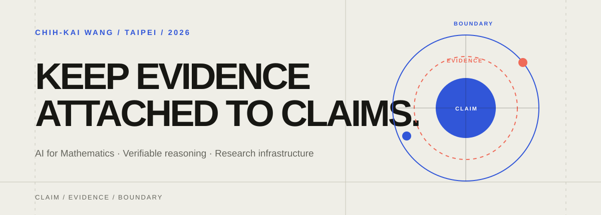

  

  <b><a href="README.md">English</a> · <a href="README.zh-TW.md">繁體中文</a> · <a href="README.zh-CN.md">简体中文</a></b>

# 王治凱 (Chih-Kai Wang)

> **致力於打造可驗證的自主 Agent 架構、內核沙盒執行環境與形式化數學證明系統。**  
> *Building verifiable agent systems, sandboxed execution runtimes, and formal mathematics tools.*

國立臺北教育大學（NTUE）數學暨資訊教育學系 數學組，預計 2028 年畢業。現居台灣台北。  
專注於自主 AI 代理系統工程、形式化定理證明（Lean 4）、程序沙盒隔離與確定性軟體工程。

[📑 履歷下載 (CV)](cv/Chih-Kai-Wang-CV.pdf) · [🐙 GitHub](https://github.com/f0909172434) · [✉️ 電子信箱](mailto:f0909172434@gmail.com)

---

## 🌟 精選核心研究與工程專案

### 🤖 自主 Agent 架構與沙盒執行環境
- **[DSH Architecture Lab](https://github.com/f0909172434/dsh-architecture-lab)**  
  *針對 DeepSeek Harness 的生產級自主 Agent 架構研究實驗室。*  
  具備 Lima Linux 虛擬機內核隔離、微美分級 Token 費用扣款攔截審計、不可變加密研究協定（`review-protocol.json`），以及涵蓋記憶與規劃四大配方（A/B/C/D）的階乘實證研究。已驗證 DeepSeek-V4.1-Flash 達到 100% 外部測試通過率。
- **[RuleShift](https://github.com/f0909172434/ruleshift)**  
  *評估 Agent 記憶在動態規則變更下適應能力的確定性本機測試床。*  
  涵蓋 800 次配對任務、自動化世界狀態驗證與可重放證據。實證發現隨需即時檢索（Retrieval）以更低呼叫成本達到與選擇性更新相同的高成功率（95.6%），提供極具成本效益的架構選型。
- **[DSH Second Agent Kit](https://github.com/f0909172434/dsh-second-agent-kit)**  
  *DeepSeek Harness 的 macOS 縱深防禦安全與記憶隔離工具組。*  
  結合 macOS Seatbelt 內核沙盒設定檔（限制 IP 網路、開放本機 Socket 通訊）、互動操作熔斷保護（防死鎖安全機制），以及基於 `AsyncLocalStorage` 的專案記憶動態隔離。
- **[MiniHarness](https://github.com/f0909172434/miniharness)**  
  *8 步驟深入學習 AI Agent Harness 系統架構的 Python 實戰工作坊。*  
  提供零外部依賴的本機學習路徑，從工具派發、Agent 循環到記憶宮殿與生產級架構，附帶完整的繁體中文先備教材與體系圖。
- **[Verified Search Plugin](https://github.com/f0909172434/dsh-plugin-verified-search)**  
  *DeepSeek Harness 的可稽核現況來源檢索與抗幻覺驗證外掛。*  
  由 250+ 項確定性測試與 42 組凍結語料庫驗證，支援結構化 JSON 擷取與顯式證據缺口標記（`unresolved`），從根源防止模型產生無根據的推論。

---

### 📐 形式化數學與自動定理證明
- **[ProofWeave Core](https://github.com/f0909172434/proofweave-math-lab)**  
  *由 Lean 4 核心驅動的結構化數學主張驗證平台。*  
  將結構化數學證明轉化為透明可稽核的認證流程，嚴謹分離「形式證明有效性」（由 Lean 4 內核驗證）與「語意陳述對齊範圍」，具備確定性運算預算。
- **[SAIR Proof Press](https://github.com/f0909172434/sair-stage2-proof-press)**  
  *等式推論求解器與 Lean 4 形式化證書產出伴隨專案。*  
  提供公開伴隨資料集、不可變基準成品、釋出輸入評估套件，以及完整的英文學術研究論文。
- **[Finite Witness](https://github.com/f0909172434/finite-witness-webmcp)**  
  *整合 WebMCP 的有限圖有界反例搜尋工具。*  
  具備有界窮舉搜尋、純前端瀏覽器資料主權、可檢視證書，以及完全獨立的 Python 重播驗證器。

---

### 🛡️ 軟體工程品質、CI 憑據與可重現性
- **[HonestCI](https://github.com/f0909172434/honest-ci)**  
  *讓綠燈 CI 真正代表測試如實執行的開發者 GitHub Action 與 CLI。*  
  封裝測試命令、驗證新鮮且未損壞的 JUnit XML 憑據、防範測試數量相對預設分支異常下降，並能警告 GitHub Actions 中可疑的假綠燈寫法（已發布於 npm 與 GitHub Marketplace，版本 `v1.0.4`）。
- **[RigorGraph](https://github.com/f0909172434/rigorgraph)**  
  *本地優先的主張-證據 DAG 圖譜與確定性審計報告系統。*  
  實作四眼審核原則（作者與獨立審查者職責分離）、DAG 環狀依賴偵測、SHA-256 位元組數位指紋，並能輸出離線獨立 HTML 審查檔案。

---

### 🔬 互動式 AI 探索與特色工具
- **[TokenScope](https://github.com/f0909172434/tokenscope)**  
  *因果注意力矩陣、Token 採樣與 BPE 的雙語互動瀏覽器實驗室。*  
  具備可檢查的 $5 \times 5$ 自注意力矩陣、溫度／top-k／top-p 概率分布控制，以及完全可反轉的 Unicode BPE 分詞器。
- **[Charlie Alpha 4B](https://github.com/f0909172434/Charlie-Alpha-4B)**  
  *專為 Apple Silicon MLX 優化的三語統計程序選擇輔助模型。*  
  提供可重現的統計決策建議，內建審慎澄清機制（`needs_clarification`），避免在資訊不足時做出武斷推論。
- **[DeepSeek Girl Pets](https://github.com/f0909172434/deepseek-girl-codex-pet)**  
  *DeepSeek Harness 與 Codex Desktop 的 16 方向動態視線追蹤桌面寵物擴充。*  
  純淨無痕設計、零 DOM 污染、官方生命週期勾子同步，且 100% 本機離線運作保障隱私。

---

## 🛠️ 技術專業與技術堆疊

| 領域分類 | 核心技術、語言與框架 |
| :--- | :--- |
| **程式語言** | Python, TypeScript, JavaScript (Node.js 20+), Lean 4, SQL, Bash/Zsh |
| **Agent 與系統工程** | DeepSeek Harness, Model Context Protocol (MCP), WebMCP, Tool Calling Loops, 記憶宮殿 |
| **沙盒與程序隔離** | Lima Linux VM, Docker, macOS Seatbelt (`sandbox-exec`), 程序組隔離, 熔斷控制器 |
| **形式化方法與數學** | Lean 4 & Mathlib, 形式證明輔助器, 等式邏輯, 有限圖搜尋, 近世代數 |
| **AI 與機器學習** | Apple Silicon MLX, PyTorch, 因果自注意力機制, BPE 分詞技術, 本機 LLM 量化推理 |
| **軟體品質與基礎架構** | GitHub Actions CI/CD, HonestCI, JUnit XML 標準, Vitest / Pytest, Prettier / ESLint / Ruff |

---

## 💡 核心工程哲學

1. **證據緊隨主張（Keep Evidence Attached to Claims）**：沒有可計算憑據的推論僅為猜想。每一項技術結論都必須由可重放的實證或形式化憑證支撐。
2. **縱深防禦與失能閉鎖（Defense-in-Depth & Fail-Closed Design）**：安全沙盒邊界、Token 費用上限與執行逾時保護皆必須具備失能閉鎖機制，在異常發生時第一時間守護系統安全與資源。
3. **確定性與離線可重現（Determinism & Reproducibility）**：研究工具與評測基準堅持支援 100% 離線執行與固定種子，擺脫對外部網路環境不可控波動的依賴。
4. **正向積極的開源工藝（Constructive Open-Source Craftsmanship）**：以清晰的人話溝通架構思維，透過透明可稽核的工程實踐賦能開發者與社群。

---

  在台北精心打造 · 熱忱歡迎軟體工程與 AI 研究實習合作機會。

